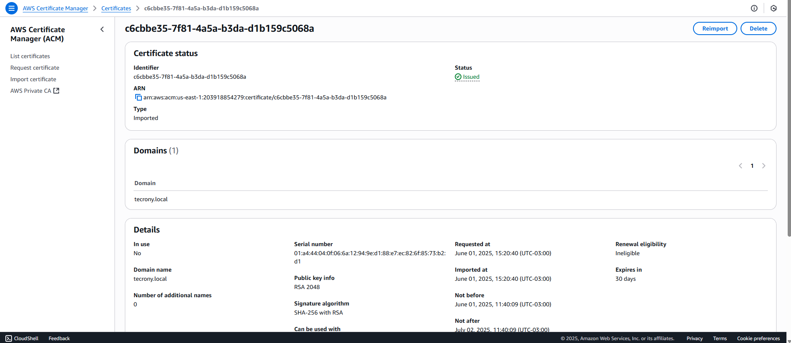
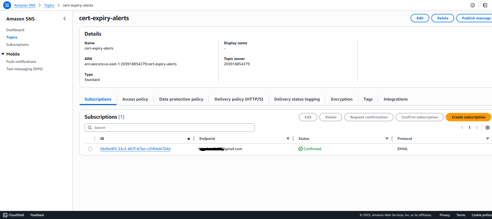
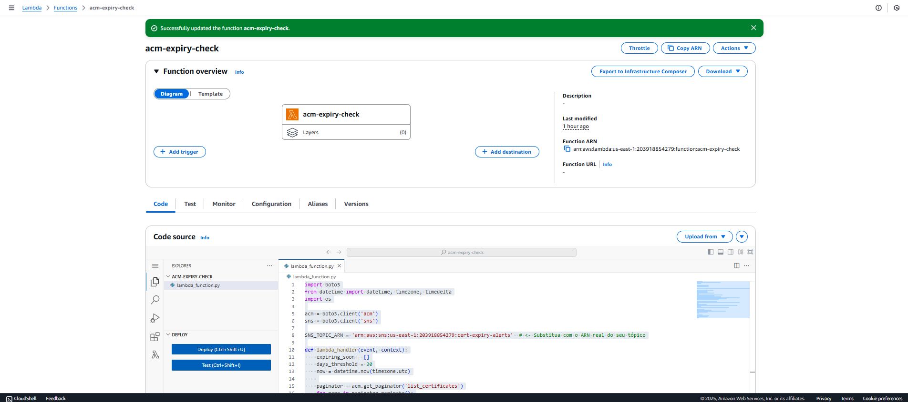
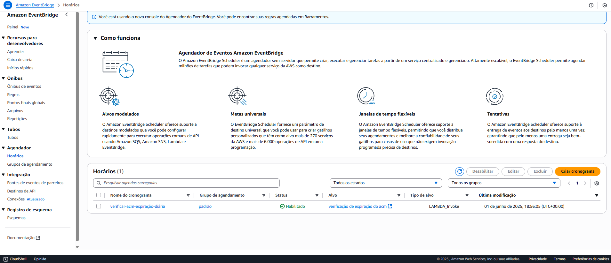
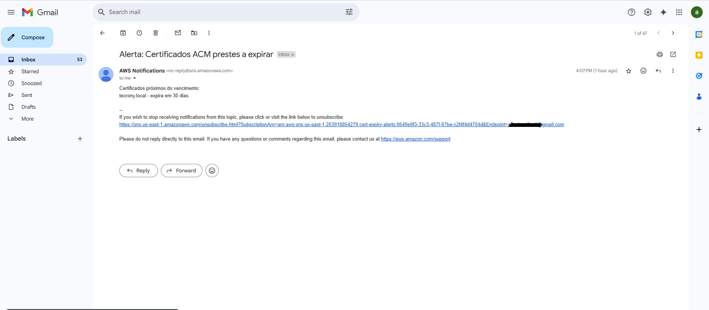

# 🔐 AWS ACM Certificate Expiration Monitor

Este projeto implementa uma solução na AWS para monitorar certificados importados no **AWS Certificate Manager (ACM)** e **enviar alertas por e-mail** 30 dias antes do vencimento do certificado.

## 📌 Objetivo

Garantir que certificados TLS/SSL não expirem sem renovação, automatizando o monitoramento e o alerta via:

| **AWS Certificate Manager (ACM)** | Serviço da AWS para gerenciar certificados SSL/TLS. Utilizado para importar e armazenar certificados manualmente. |
| **Amazon SNS (Simple Notification Service)** | Serviço de mensagens que envia notificações por e-mail, SMS ou HTTP. Utilizado para alertar sobre certificados vencendo. |
| **AWS Lambda** | Serviço serverless que executa funções em resposta a eventos. Utilizado para escanear os certificados no ACM e disparar alertas. |
| **Amazon EventBridge (CloudWatch Events)** | Serviço de eventos e agendamento. Utilizado para acionar a função Lambda uma vez por dia automaticamente. |
| **IAM (Identity and Access Management)** | Serviço de controle de permissões. Criamos uma política personalizada para permitir que a Lambda acesse ACM e SNS. |

---

## 💡 Visão Geral da Solução

1. **Certificados** importados no ACM.
2. Uma **função Lambda** lista certificados e identifica quais vencem em até 30 dias.
3. Se encontrados, a Lambda publica uma mensagem em um **tópico SNS**.
4. O SNS envia um **e-mail de alerta** à equipe.
5. Um **agendamento no EventBridge** dispara a função Lambda diariamente.

---

## 🛠️ Etapas via Console AWS

### 1. Criar e importar certificado no ACM
- Certificado autoassinado gerado via `openssl` no Windows.
- Importado no **AWS ACM** com chave privada e cadeia intermediária.

### 2. Criar Tópico SNS
- Nome: `ACM-Certificates-Alerts`
- Assinatura: E-mail (confirmado pelo destinatário)

### 3. Criar Função Lambda
- Linguagem: Python 3.12
- Nome: `CheckACMCertificates`
- Permissões (IAM Policy customizada):
  - `acm:ListCertificates`
  - `acm:DescribeCertificate`
  - `sns:Publish`

### 4. Criar Regra do EventBridge
- Agendamento: `rate(1 day)`
- Ação: Invocar função Lambda

---

## 🧪 Testes Realizados

- ✅ Certificado importado com vencimento curto.
- ✅ Execução manual da Lambda com alerta enviado.
- ✅ EventBridge executando diariamente.

---

## 💰 Custos (Camada Gratuita)

| Serviço         | Uso no Lab                      | Custo Estimado             |
|-----------------|---------------------------------|----------------------------|
| **ACM**         | Certificado importado           | **Gratuito**               |
| **SNS**         | Notificação 1x/dia              | **Gratuito**               |
| **Lambda**      | Execução 1x/dia                 | **Gratuito**               |
| **EventBridge** | 1 regra agendada (1/dia)        | **Gratuito**               |

**💸 Total mensal estimado: R$ 0,00 (dentro da camada gratuita).**

---

## 🖼️ Prints do Lab

Veja abaixo os principais passos do lab via interface AWS.

1. Certificado importado no ACM  
   

2. Tópico SNS criado com assinatura por e-mail  
   

3. Lambda configurada e executando corretamente  
   

4. Regra no EventBridge com agendamento diário  
   

5. Alerta de expiração recebido por e-mail  
   

## 💻 Tecnologias

- AWS Console
- Python 3.12
- Boto3 (AWS SDK for Python)

## 🚀 Próximos Passos

- [ ] Provisionamento com **Terraform**
- [ ] Integração com **CloudWatch Logs**
- [ ] Template reutilizável para múltiplas contas

---

